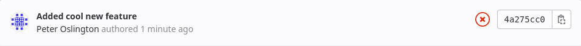

# COMP1100 Assignment 3

In this assignment, you will develop a [software
agent](https://en.wikipedia.org/wiki/Software_agent) or *AI bot* that
plays a board game called Sushi Go. We have
implemented the rules of the game for you. Your task is to decide
how is best to play.

Sushi Go is a card drafting game where players compete to build collections of sushi-themed cards that score the most points. This delightful game was designed by Phil Walker-Harding and published by Gamewright. For the purposes of this assignment, we have made some modifications to the rules.

{:.msg-info}  
This assignment is worth 15% of your final grade.

{:.msg-warn}  
**Deadline**: Sunday 29th of October, 2023, at 11:00pm Canberra time _sharp_

Note: Late submissions **will not be marked** unless you have an
**approved extension**.

{:.info-box}
We **highly** recommend committing your work as you go, and pushing regularly.
Do _not_ wait until you are finished to commit and push for the first time, as
you run the risk of missing the deadline and having nothing submitted. An
unfinished assignment is worth more than no assignment.


## Overview of Tasks

This assignment is marked out of 100.


| **Task**                              | **Marks** |
|---------------------------------------|--------------|
| Main Task: Sushi GO AI   | 55 Marks     |
| Unit Tests                            | 10 Marks     |
| Coding Style                          | 10 Marks     |
| Technical Report                      | 25 Marks     |

{:.msg-warn}  
As with assignment 2, code that does not compile will be
penalised heavily. This means that **both** the commands `cabal v2-run game`
(with sensible arguments) **and** `cabal v2-test` **must** run without
errors. If **either** command fails with an error, a significant mark deduction
will be applied. If you have a partial solution that you cannot get
working, you should comment it out and write an additional comment
directing your tutor's attention to it. You are also welcome to ask questions
about error messages in drop-ins or on Ed.

If marks are deducted for warnings, they will only be from warnings in `AI.hs`
and `AITests.hs`.

{:.info-box}
To help you ensure your submitted code is compiling, we've added a
[Continuous Integration](https://en.wikipedia.org/wiki/Continuous_integration) 
(CI) script to this assignment. This will check that your code compiles, and 
mark any commit that fails with a red x on the commit, as shown below. You need
to ensure that your latest commit on submission displays a green tick.

<centre><a href="pictures/build-error.png"></a></centre>

## Getting Started

1. Fork the assignment repository and create a project for it in 
  VS Code/Codium, following the same steps as in 
  [Lab 2](https://cs.anu.edu.au/courses/comp1100/labs/02/#forking-a-project).
  The assignment repository is at
  <https://gitlab.cecs.anu.edu.au/comp1100/2023s2/studentfiles/asst3-1100_s2_2023>.

2. Add **our** version of the repository as a *remote* called
   `upstream`. This allows us to provide additional fixes in the unlikely
   case that they are required. You do this by doing the following:

   - Go to the command palette in VSCode (or VSCodium) by pressing
    `Ctrl + Shift + p`.

   - Type `git remote`.

   - Click **Git: Add Remote**.
   
   - Enter `upstream` into the box for the remote name.
   
   - Put the following URL as the remote url:
    `https://gitlab.cecs.anu.edu.au/comp1100/2023s2/studentfiles/asst3-1100_s2_2023.git`.

## Overview of the Game

The aim of Sushi Go (and our restricted version) is to collect cards (representing dishes) to make the highest-scoring (most delicious) meal possible. There are two players: Player 1 (`Player1`) and Player 2 (`Player2`). 

There is a deck of cards which consists of the following: 

| Card type     | Count |
|-----------|-------|
|Nigiri 1| 5 |
|Nigiri 2| 5 |
|Nigiri 3| 5 |
|Wasabi Nothing| 8 |
|Dumplings| 8 |
|Eel| 8|
|Tofu| 8 |
|Tempura| 8 |
|Tea| 8|
|Temaki| 8 |

At the start of the game the cards are shuffled and each player is dealt 20 cards each. (Note: As the original deck has more than 40 cards, the set of cards in play each game differ). 

There are four collections of cards, the hand and the cards for each player. Player1's hand denotes the cards that the player is to chose from. While Player1's cards are the ones Player1 had already selected. Similarly, Player2's hand denote what player 2 selects from and their cards are the cards that the player had already selected. 

Thus when the game is starting, both players' cards would be empty, while they would have a selection of 20 cards in their hand. 

First player 1 chooses a single card from their hand of cards to keep. After placing the selected card, Player 1 does the same.  After Player 2’s turn, both players swap hands and keep going. The game is over when both players' hands are empty. The winner is the person whose cards are worth the most points, according to the scoring rules below.

### The Cards 

#### Nigiri 
Nigiri(`Nigiri Int`) is your basic meal, and is worth the number of points in its argument (between 1 and 3, inclusive). It is more delicious if you add `Wasabi`. 

#### Wasabi 
Wasabi (`Wasabi (Maybe Card)`) makes Nigiri taste better! The next Nigiri that you take will be worth triple the points (for example `Wasabi (Nigiri 2)` will be worth $2\times3 =6$ points). If you take a Wasabi but do not later get a Nigiri to put on it, the Wasabi card will have no effect, so pay attention to the order in which you take cards.

#### Dumplings 
Dumplings are delicious! The more you have the more you want! They score depends on how many you have 

| Count     | Score |
|-----------|-------|
| 0         | 0     |
| 1         | 1     |
| 2         | 3     |
| 3         | 6     |
| 4         | 10    |
| 5 or more | 15    |

#### Eel 

Eel (`Eel`) tastes terrible when you first try it, but you grow to like it after that.  

| Count     | Score |
|-----------|-------|
| 0         | 0     |
| 1         | -3    |
| 2 or more | 7     |

#### Tofu 
Tofu (`Tofu`) is great initially, but after a point it starts to make you sick! 

| Count     | Score |
|-----------|-------|
| 0         | 0     |
| 1         | 2     |
| 2         | 6     |
| 3 or more | 0     |

#### Tempura 
Tempura (`Tempura`) is amazing! But you have to have it in pairs. Each pair is worth 5 points. 

#### Tea 
Tea (`Tea`) gives your meal that amazing ending that you were craving! At the end of the round each tea card will be worth the maximum number of cards you have of a certain type. 
- Note that if you have `Wasabi (Nigiri 1)` it counts as both a `Wasabi` and a `Nigiri`
- If you have more tea cards than other cards, then each tea card will be worth the count of tea cards.
- For example if we have: 
  `Nigiri 1, Wasabi Nothing, Wasabi (Nigiri 1), Dumpling, Wasabi (Nigiri 2), Tea`, this will count as 3 `Wasabi`, 2 `Nigiri 1`, 1 `Nigiri 2`, 1 `Dumpling`, 1 `Tea`. Thus indicating that the tea card will be worth 3 points. 

(This is slightly different from the original rules.)

#### Temaki 
With Temaki (`Temaki`), you wouldn't want anyone else to have it! At the end of the game, the player with the most temaki will get 4 points, while the player with the least will get (-4) points. If both players have the same amount, neither player will be awarded any points.


## Initial set up
As mentioned above, each player will be dealt 20 cards. There will be no cards. (`Player1` cards and `Player2` cards are empty)

`Player1` would be first to make a move. 

## Overview of the Repository

Most of your code will be written in `src/AI.hs`, but you will also
need to write tests in `src/AITests.hs`.

### Other Files

* `src/SushiGo.hs` implements the rules of SushiGo. You should read
  through this file and familiarise yourself with the data
  declarations and the type signatures of the functions in it, as you
  will use some of these to analyse the game states. You do not need
  to understand how the functions in this file work in detail. You do not need to change or implement anything in this file. 

* `src/SushiGoTests.hs` implements some unit tests for the game. You
  are welcome to read through it.

* `src/AITests.hs` is an empty file for you to write tests for your
  agent.

* `src/Testing.hs` is a simple test framework similar to the one in
  Assignment 2. However, it has been extended so that you can group
  related tests together for clarity.

* `src/Dragons` contains all the other code that makes the framework
  run. You do not need to read or understand anything in this
  directory. Here be dragons! (On medieval maps they drew pictures of
  dragons or sea monsters over uncharted areas.) The code in those
  files is beyond the areas of Haskell which this course explores.

* `Setup.hs` tells cabal that this is a normal package with no unusual
  build steps. Some complex packages (that we will not see in this
  course) need to put more complex code here. You are not required to
  understand it.

* `comp1100-assignment3.cabal` tells the cabal build tool how to build
  your assignment. We will discuss how to use `cabal` below.

* `.ghcid` tells the `ghcid` tool which command to run, which is what
  supplies VSCodium with error highlighting that automatically updates
  when you save a file.

* `.gitignore` tells `git` which files it should not put into version
  control. These are often generated files, so it doesn't make sense
  to place them under version control.

## Overview of Cabal

As before, we are using the `cabal` tool to build the assignment
code. The commands provided are very similar to last time:

* `cabal v2-build`: Compile your assignment.

* `cabal v2-run game`: Build your assignment (if necessary), and run
  the test program. We discuss the test program in detail below, as
  there are a number of ways to launch it.

* `cabal repl comp1100-assignment3`: Run the GHCi interpreter over
  your project so you can test functions interactively. It's a good idea to run a `cabal v2-clean` before you run the above.

* `cabal v2-test`: Build and run the tests. This assignment is set up
   to run a unit test suite, and as with Assignment 2 you will be
   writing tests. The unit tests will abort on the first failure, or
   the first call to a function that is `undefined`.

* `cabal v2-haddock`: Generate documentation in HTML format, which you
  can read with a web browser. This might be a nice way to read a
  summary of the game module, but it also documents the `Dragons`
  modules which you can safely ignore.

* `cabal v2-clean`: Cleans up the temporary files and build artifacts stored in the dist-newstyle folder.

{:.msg-info}  
You should execute these cabal commands in the **top-level directory**
of your project: `comp1100-assignment3` (i.e., the directory you are
in when you launch a terminal from VSCodium).

## Overview of the Test Program

To run the test program, you need to provide it with command line
arguments that tell it who is playing. This command will let you play
against the current `"default"` AI bot.
Before you replace this with your own bot, the default will be
`firstLegalMove` : 

```
cabal v2-run game -- --p1 human --p2 ai
```

using `ai` to get the default ai is part of how we mark
your assignment, so it is **vital** that you update your
default bot to be whatever you want to be marked!

For instance if you want your minimax to be the bot that is marked, you should change your code to look like this 

```haskell
ais :: [(String, AI)]
ais = [ ("firstLegal", NoLookahead firstLegal)
      , ("greedy", NoLookahead greedy)
      , ("default", WithLookahead minimax)
      ]
```
Note that there should be only one default ai. 

To play against your ai, you need to type in the letters next to a card to pick it from your hand. 

To play with a differently named AI, say the one you have named `"greedy`, use:

```
cabal v2-run game -- --p1 human --p2 ai:greedy
```

In general, the command to run the game looks like this:

```
cabal v2-run game -- ARGS
```

Replace `ARGS` with a collection of arguments from the following list:

* `--seed INT`: Sets a seed for how the deck would be shuffled, the INT is to be a positive number. This would allow you to check your performance on a certain game setup. 

* `--timeout DURATION`: Change the amount of time (in decimal seconds)
  that AI functions are given to think of a move (default = `4.0`).
  You may want to set this to a smaller number when testing your program,
  so that things run faster. 

* `--debug-lookahead`: When an AI is done thinking, print out how many
  moves ahead it considered, and the candidate move it came up with at
  each level of lookahead. The first item in the printed list is the
  move it came up with at lookahead 1, the second item is the move it
  came up with at lookahead 2, and so on.

* `--ui text`: Show the game in the terminal.

* `--ui json`: Run a non-interactive game (i.e., AI vs. AI, or AI *vs*
  network), and output a report of the game in JSON format. You
  probably won't have a use for this, but it's documented here for
  completeness.

* `--host PORT`: Listen for a network connection on `PORT`. You only
  need this for network play (see below).

* `--connect HOST:PORT`: Connect to someone else's game. You only need
  this for network play (see below).

* `--p1 PLAYER`: Specify the first player. Required.

* `--p2 PLAYER`: Specify the second player. Required.

The `PLAYER` parameters describe who is playing, and can take one of
the following forms:

| **Format**  | **Effect**                                                  |
|-------------|-------------------------------------------------------------|
| `human`     | Ask the person at the computer for moves.                   |
| `ai`        | Ask the `"default"` AI for moves.                           |
| `ai:AINAME` | Ask a specific AI for moves (example: `ai:firstLegalMove`). |
| `network`   | Wait for a move from the network.                           |

### Network Play

{:.msg-warn}  
Network play is provided in the hope that it will be useful, but we
are unable to provide support for this feature, or diagnose problems
related to tunnelling network connections between computers.

The assignment framework supports network play, so that you can test
agents against each other without sharing code. One machine must
_host_ the game, and the other machine must _connect_ to the game. In
the example below, machine A hosts a game on port 5000 with the agent
`crashOverride` as player 1, then machine B connects to the game,
providing the AI `chinook` as player 2:

```
# On Machine A:
cabal v2-run game -- --host 5000 --p1 ai:crashOverride --p2 network

# On Machine B (you'll need Machine A's external IP address somehow):
cabal v2-run game -- --connect 198.51.100.66:5000 --p1 network --p2 ai:chinook
```

{:.msg-info}  
Under the bonnet, the network code makes a single TCP connection, and
moves are sent over the network in JSON. You will need to set up your
modem/router to forward connections to the machine running your
assignment. A service like [ngrok](https://ngrok.com/) may help, but
as previously mentioned we are unable to provide any support for this
feature.


## Main Task: Sushi Go AI (55 Marks)

Implement an AI (of type `AI`, defined in `src/AI.hs`). There is a
list called `ais` in that file, and we will mark the AI you call
`"default"` in that list. This list is also where the framework looks
when it tries to load an AI by name.

We will test your AI's performance by comparing it to implementations
written by course staff, using a variety of standard approaches. Its
performance against these AIs will form a large part of the marks for
this task.

{:.msg-warn}  
It is **vital** that you indicate one AI as `"default"`, otherwise we
will not know which one to mark. To indicate an AI as `"default"`,
you must have a `(String, AI)` pair in the `ais` list of AIs
in `src/AI.hs` where the `String` is **precisely** `"default"`. 


## Understanding the `AI` Type

The `AI` type has two constructors, depending on whether you are
implementing a simple AI that looks only at the current state, or a
more complicated AI that performs look-ahead.

The `NoLookahead` constructor takes as its argument a function of type
`GameState -> Move`. That is, the function you provide should look at
the current state of the game and return the move to play. This
constructor is intended for very simple AIs that do not look ahead in
the game tree. As such, this function should never run for more than
a moment at a time, but nevertheless, it is also subject to the timeout
of 4 seconds.

The `WithLookahead` constructor takes as its argument a function of
type `GameState -> Int -> Move`. The `Int` parameter may be used for any purpose,
but we anticipate that you will use it to
represent how many steps you should try to look ahead in the game
tree. The assignment framework will call your function over and over,
with look-ahead `1`, then `2`, then `3`, etc., until it runs out of
time. The framework will take the result of the most recent successful
function call as your AI's best move. If your AI does not return a
move in time, the program will stop with an error.


### Getting Started

This is a very open-ended task, and it will probably help if you build
up your solution a little at a time. We suggest some approaches below.

Your AI should inspect the `Turn` within the `Game` to see whose turn
it is. You may call `error` if the `Turn` is `GameOver` - your AI
should never be called on a finished game. Your AI can then use the
`Player` value and `otherPlayer` function to work out how to evaluate
the board.

{:.msg-info}  
You may also assume that we will only ever call your AI if there is a
legal move it can make (when the player's hand is never empty). In particular, this means that we will not
deduct marks for assuming that a list of legal moves is non-empty
(e.g., you used the `head` function). Note that gratuitous use of
`head` and `tail` is still poor style. Note that, in general, you cannot
make this assumption about `GameStates` you have generated
within your AI function.

### First Legal Move

The simplest AI you can build is one that makes the first legal move
it can. We have provided this for you, so you can see what a simple
`AI` looks like.

### Interlude: Heuristics

Heuristic functions are discussed in the lecture on game trees.  We
expect the quality of your heuristic function---how accurately it
scores game states---to have a large impact on how well your AI
performs.

### Greedy Strategy

"Greedy strategies" are the class of strategies that make moves that
provide the greatest _immediate_ advantage. In the context of this
game, it means always making the move that will give it the greatest
increase in heuristic. Try writing a simple heuristic and a greedy
strategy, and see whether it beats your "firstLegalMove" AI. Bear in
mind that in a game like this, `firstLegalMove` will not play terribly,
as it still must capture when given the opportunity.


### Interlude: Game Trees

To make your AI smarter, it is a good idea for it to look into the
future and consider responses to its moves, its responses to those
responses, and so on. The lecture on game trees may help you here.


### Minimax

Greedy strategies can often miss opportunities that need some
planning, and get tricked into silly traps by smarter opponents. The
Minimax algorithm was discussed in the lecture on game trees and will 
likely give better performance than a greedy strategy.

### Pruning

Once you have Minimax working, you may find that your AI explores a
number of options that cannot possibly influence the result. Cutting
off branches of the search space early is called _pruning_, and one
effective method of pruning is called **alpha-beta pruning** as
discussed in lectures. Good pruning may allow your search to explore
deeper within the time limit it has to make its move.

### Other Hints

* There are four main ways your AI can be made smarter:

  - Look-ahead: If your function runs efficiently, it can see further
    into the future before it runs out of time. The more moves into
    the future it looks, the more likely it will find good moves that
    are not immediately obvious. Example: at 1 level of look-ahead, a
    move may let you capture a lot of pieces, but at deeper look-ahead
    you might see that it leaves you open to a large counter-capture.

  - Heuristic: You will not have time to look all the way to the end
    of every possible game. Your heuristic function guesses how good a
    `Game` is for each player. If your heuristic is accurate, it will
    correctly identify strong and weak states.

  - Search Strategy: This determines how your AI decides which
    heuristic state to aim for. Greedy strategies look for the best
    state they can (according to the heuristic) and move towards that
    state. More sophisticated strategies like Minimax consider the
    opponent's moves when planning.

  - Pruning: if you can discard parts of the game tree without
    considering them in detail, you can process game trees faster and
    achieve a deeper look-ahead in the allotted running
    time. Alpha-beta pruning is one example; there are others.

* Choosing a good heuristic function is very important, as it gives your AI a way to value its position that is smarter than just looking at current score. If there is only one copy of Sashimi in the game, you will never get the 3 copies to get 10 points, so the card is worth zero and you probably will not want to pick it. If you can complete the set, each card in the set is effectively worth a pretty-good 3+1/3 points.

* Do not try to do everything at once. This does not work in
  production code and often does not work in assignment code
  either. Get something working, then take your improved understanding
  of the problem to the more complex algorithms.

* As you refine your bots, test them against each other to see whether
  your changes are actually an improvement.


## Unit Tests (10 Marks)

As with Assignment 2, you will be expected to write unit tests to
convince yourself that your code is correct. The testing code has been
extended from last time---`src/Testing.hs` now allows you to group
tests into a tree structure. As before, you run the tests using `cabal
v2-test`.

### Your Task

Add tests to `src/AITests.hs` to test your AI.

#### Hints

* Most of the hints from Assignment 2 apply here. Re-read those.

* If a function is giving you an unexpected result, try breaking it
  into parts and writing tests for each part. This helps you isolate
  the incorrect parts, and gives you smaller functions to fix.

* If your function has subtle details that need to be correct, think
  about writing tests to ensure those details do not get missed as you
  work on your code.

## Coding Style (10 Marks)

As you write increasingly complex code, it is increasingly important
that the code remains readable. This saves wasted effort understanding
messy code, which makes it easier to think about the problem and your
solution to it.

If you wish, you know how, and you have a good reason,
you may split your code into multiple modules. However this is not a 
requirement, and you will never be penalised for not doing so.

You **MUST NOT** edit any of the files in the framework (with the
obvious exceptions of `AI.hs` and `AITests.hs`. You may also edit
`SushiGoTests.hs` but there should be no reason to.)

Note: We will not regard code that is used by any of your AIs as 'dead code', even if it not used by your submitted default AI. But we will only mark your default AI.


### Your Task

Ensure that your code is written in good Haskell style.

## Technical Report (COMP1100: 25 marks)

| **Description**                     | **COMP1100** |
|-------------------------------------|--------------|
| Documentation (what you did)        | 7            |
| Reflection (why you did it)         | 7            |
| Testing (how you tested)            | 7            |
| Style (the report presentation)     | 4            |
|  __TOTAL__                          | __25__       |


You should write a concise [technical
report](https://comp.anu.edu.au/courses/comp1100/resources/07-reports/ )
explaining your design choices in
implementing your program. The **maximum word count is 1500**.
This is a *limit*, not a *quota*; concise presentation
is a virtue.

{:.warn-box}
Once again: This is not a required word count. They are the **maximum
number of words** that your marker will read. If you can do it in
fewer words without compromising the presentation, please do so.

Your report must be in PDF format, located at the root of your
assignment repository on GitLab and named `Report.pdf`. Otherwise, it
may not be marked, or will be marked but with a penalty. You should
double-check **on GitLab** that this is typed correctly.

The report must have a **title page** with the following items:

* Your name;

* Your laboratory time and tutor; and

* Your university ID.

### Content and Structure

Your audience is the tutors and lecturers, who are proficient at programming
and understand most concepts. Therefore you should not, for example, waste
words describing the syntax of Haskell or how recursion works. After reading
your technical report, the reader should thoroughly understand:
1. What problem
your program is trying to solve;
2. The reasons behind major design choices in it; as well as
3. How it was tested. 

Your report should give a broad overview of your
program, but focus on the specifics of what *you* did and why.

Remember that the tutors have access to the above assignment
specification, and if your report *only* contains details from it then
you will only receive minimal marks. Below is a potential outline for
the structure of your report and some things you might discuss in it.

#### Introduction

If you wish to do so you can write an introduction. In it, give:

* A brief overview of your program:

  - how it works; and

  - what it is designed to do.

* If you have changed the way the controls work,
  or added something that may make your program behave unexpectedly,
  then it would be worth making a note of it here.

This section is particularly relevant to more complicated programs.

#### Analysis of your Program

The purpose of this section is to describe your program to the reader, 
both in detail and at a high level.

Talk about what features your program actually has. We know what we asked
for (the features in this document!), but what does your program actually
let a user do? How does your program work as a whole?

How does it achieve this? Let us know how each individual function works
and how they work together to solve particular design goals.

A successful report will demonstrate conceptional understanding of all relevant
functions, and depicts a holistic view of program structure through
discussion of what it is and hour it works.

#### Rationale and Reflection

The purpose of this section is to describe the design decisions you made
while writing the program, to the reader. 

Tell us the reasoning behind the choices you detailed above.
Tell us the assumptions you made about user behaviour.
Why did you solve the problems the way you did?
Why did you write the functions you wrote?
Did you make any other assumptions?

For example: 

_"I implemented the `checkFirst` helper function after 
reading this blog post (citing the post as a reference), 
claiming that users of quadrant based drawing programs virtually always draw 
their first shape in the top-right quadrant. Deciding to use this as my base
assumption for user-behaviour, I decided to save on 
quadrant-dependent calculation of trigonometric ratios by always assuming the 
first shape is drawn in this quadrant. This in turn meant I needed a function 
to check if a shape was the first one drawn."_

This is a _critical reflection_ not a personal one. You're explaining
the justification and reasoning behind the choices you made.

A successful report will give a thorough explanation of the process followed
to reach a final design, including relevant reasoning and assumptions / 
influences.

In this section, you might also reflect on any conceptual or technical issues
you encountered, particularly if you were unable to complete your program. 
Try to include details such as:

- theories as to what caused the problem;    
- suggestions of things that might have fixed it; and
- discussion about what you did try, and the results of these attempts.

#### Testing
- How did you test individual functions?
    - Be specific about this - the tutors know that you have tested
    your program, but they want to know *how*.
    - Describe the tests that prove individual functions on their own
      behave as expected (i.e. testing a function with different
      inputs and doing a calculation by hand to check that the outputs
      are correct).
  - How did you test the entire program? What tests did you perform to
    show that the program behaves as expected in all (even unexpected)
    cases?
  - How did you test the quality of your AI's play?


A successful report will demonstrate evidence of a _process_ that checked most, 
if not all, of the relevant parts of the program through testing. Such a report
would combine this with some discussion of _why_ these testing results prove
or justify program correctness.

#### Style
A successful report should have excellent structure, writing style, and 
formatting. Write professionally, use diagrams where appropriate but not
otherwise, ensure your report has correct grammar and spelling.

{:.info-box}
This is a list of **suggestions**, not requirements. You should only
discuss items from this list if you have something interesting to
write.

### Things to avoid in a technical report


* Line by line explanations of large portions of code. (If you want to
  include a specific line of code, be sure to format as described in
  the "Format" section below).

* Pictures of code, VSCodium or your IDE.

* Content that is not your own, unless cited.

* Grammatical errors or misspellings. Proof-read it before submission.

* Informal language - a technical report is a professional document, and as
  such should avoid things such as:

  - Unnecessary abbreviations (atm, btw, ps, and so on), emojis, and
    emoticons; and

  - Stories / recounts of events not relevant to the development of the program.

* Irrelevant diagrams, graphs, and charts. Unnecessary elements will
  distract from the important content. Keep it succinct and focused.

If you need additional help with report writing, the
[academic skills writing centre](http://www.anu.edu.au/students/academic-skills/appointments/academic-skills-writing-centre)
has a peer writing service and writing coaches.


### Format

You are not required to follow any specific style guide (such as APA
or Harvard). However, here are some tips which will make your report
more pleasant to read, and make more sense to someone with a computer
science background.


* Colours should be kept minimal. If you need to use colour, make sure it is
  absolutely necessary.

* If you are using graphics, make sure they are *vector* graphics (that stay
  sharp even as the reader zooms in on them).

* Any code, including type/function/module names or file names, that
  appears in your document should have a monospaced font (such as
  Consolas, Courier New, Lucida Console, or Monaco).

* Other text should be set in serif fonts (popular choices are Times,
  Palatino, Sabon, Minion, or Caslon).

* When available, automatic *ligatures* should be activated.

* Do not use underscore to highlight your text.

* Text should be at least 1.5 spaced.


## Communication

**Do not** post your code publicly, either on Ed or via other
forums. Posts on Ed trigger emails to all students, so if by
mistake you post your code publicly, others will have access to your
code and you may be held responsible for plagiarism.

Once again, and we cannot stress this enough: **do not post your code
publicly** . If you need help with your code, post it *privately* to the
instructors.

When brainstorming with your friends, **do not share code**. There
might be pressure from your friends, but this is for both your and
their benefit. Anything that smells of plagiarism will be investigated
and there may be serious consequences.

Sharing ideas and sketches is perfectly fine, but sharing should stop
before you risk handing in suspiciously similar solutions.


Course staff will not look at assignment code unless it is posted
**privately** on Ed, or shared in a drop-in consultation.

Course staff will typically give assistance by asking questions,
directing you to relevant exercises from the labs, or definitions and
examples from the lectures.

{:.info-box}
Before the assignment is due, course staff will not give individual
tips on writing functions for the assignment or how your code can be
improved. We will help you get unstuck by asking questions and
pointing you to relevant lecture and lab material. You will receive
feedback on your work when marks are released.


## Submission Advice

Start early, and aim to finish the assignment several days before the
due date. At least 24 hours before the deadline, you should:

* Re-read the specification one final time, and make sure you've
  covered everything.

  - You have fully read and understand the entire assignment specification. 
    See the "Overview of Tasks" section to check that you have completed all
    tasks.

* Confirm that the latest version of your code has been pushed to
  GitLab.

  - You can confirm that the latest version
    of your code has been pushed to GitLab by using your browser to visit
    https://gitlab.cecs.anu.edu.au/uXXXXXXX/asst3-1100_s2_2023, where XXXXXXX
    is your student number.

* Ensure your program compiles and runs, including the `cabal v2-test`
  test suite. Make sure you have a green CI tick on your latest commit in Gitlab

* Ensure your submission works on the lab machines. If it does not, it
  may fail tests used by the instructors.

* Proof-read and spell-check your report.

* Verify that your report is in PDF format, located at the root of your project.

* Verify that your report is in PDF format, located at the root of your project
  directory (not in `src`), and named `Report.pdf`. That capital `R`
  is important - Linux uses a case-sensitive file system. 
  Otherwise, it may not be marked. 

* Check that all work including your report is submitted by viewing your assignment repo **on Gitlab**.

We recommend that you *do not wait* until you are finished to commit and 
push your work. Commit and push as you work, to reduce the risk of
submission errors at the last minute.
